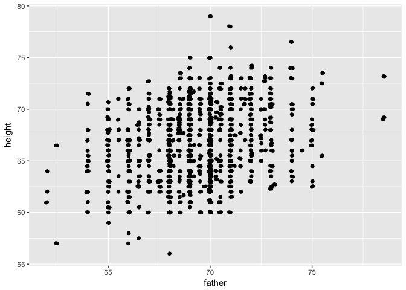
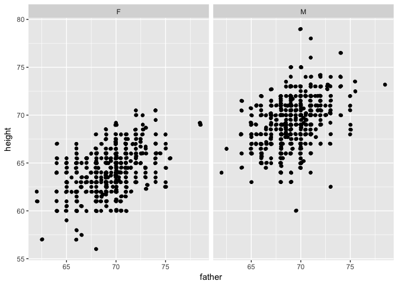
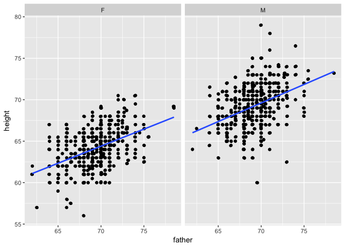
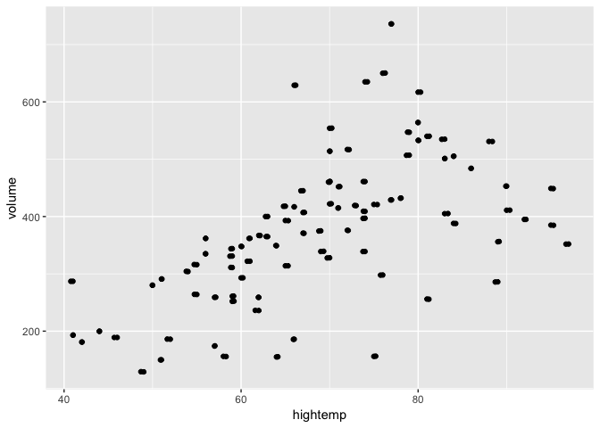
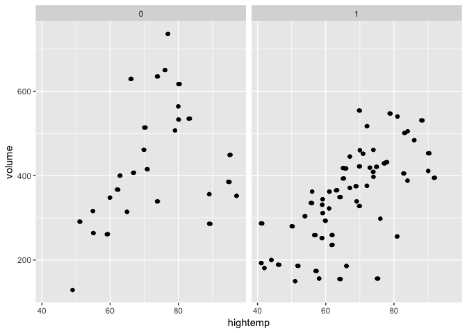
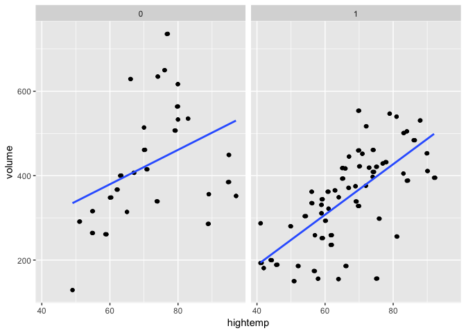
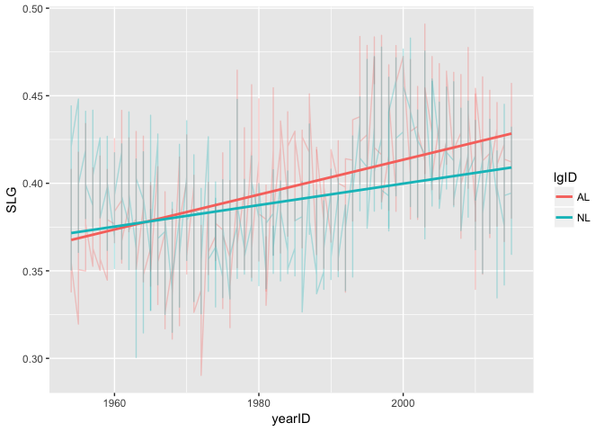

hw\_2\_review
================
Kammy Chiu
February 24, 2017

### 3.1

Create a scatterplot of each person's height against their father's height:

``` r
height <- ggplot(Galton, aes(x = father, y = height)) +
  geom_point() +
  geom_jitter()
height
```



Separate your plot into facets by sex:

``` r
facet_height <- height + facet_wrap(~sex)
facet_height
```



Add regression lines to all of your facets:

``` r
reg_height <- facet_height + geom_smooth(method = "lm", se = F)
reg_height
```



### 3.2

Create a scatterplot of the number of crossings per day volume against the high temperature that day:

``` r
crossings <- ggplot(RailTrail, aes(x = hightemp, y = volume)) +
  geom_point() +
  geom_jitter()
crossings
```



Separate your plots into facets by weekday:

``` r
facet_crossings <- crossings + facet_wrap(~weekday)
facet_crossings
```



Add regression lines to the two facets:

``` r
reg_crossings <- facet_crossings + geom_smooth(method = "lm", se = F)
reg_crossings
```



### 4.8

Define two new variables in the Teams data frame from the Lahman package: batting average (BA) and slugging percentage (SLG). Batting average is the ratio of hits (H) to at-bats (AB), and slugging percentage is total bases divided by at-bats.

``` r
Teams_BA_SLG <- Teams %>%
  mutate(BA = H / AB,
         SLG = (H + X2B + X3B*2 + HR*3) / AB)
```

### 4.9

Plot a time series of SLG since 1954 conditioned by lgID. Is slugging percentage typically higher in the American League (AL) or the National League (NL)? Can you think of why this might be the case?

``` r
Teams_BA_SLG %>%
  filter(yearID >= 1954) %>%
  ggplot(aes(x = yearID, y = SLG)) +
  geom_line(aes(col = lgID), alpha = .3) +
  geom_smooth(method = "lm", aes(color = lgID), se = F)
```



Slugging percentage is typically higher in the AL than in the NL. Since slugging percentage is total bases divided by at-bats, the AL may have a higher slugging percentage due to a smaller at-bats number, or a higher number of total bases, or both. According to Wikipedia the AL adopted the "Designated Hitter" (DH) rule in 1973. The DH bats in place of the pitcher, so the number of at bats would be lower for the AL.

### 4.10

Display the top 15 teams ranked in terms of slugging percentage in MLB history.

``` r
top15 <- Teams_BA_SLG %>%
  arrange(desc(SLG)) %>%
  slice(1:15) %>%
  select(yearID, name, SLG)

top15
```

    ##    yearID              name       SLG
    ## 1    2003    Boston Red Sox 0.4908996
    ## 2    1927  New York Yankees 0.4890593
    ## 3    1930  New York Yankees 0.4877019
    ## 4    1997  Seattle Mariners 0.4845030
    ## 5    1894 Boston Beaneaters 0.4843345
    ## 6    1994 Cleveland Indians 0.4838389
    ## 7    1996  Seattle Mariners 0.4835921
    ## 8    1936  New York Yankees 0.4834556
    ## 9    2001  Colorado Rockies 0.4829525
    ## 10   1894 Baltimore Orioles 0.4828089
    ## 11   1930      Chicago Cubs 0.4809174
    ## 12   1995 Cleveland Indians 0.4787192
    ## 13   1999     Texas Rangers 0.4786763
    ## 14   1997  Colorado Rockies 0.4777798
    ## 15   2009  New York Yankees 0.4775618

Repeat this using teams since 1969.

``` r
top15_1969 <- Teams_BA_SLG %>%
  filter(yearID >= 1969) %>%
  arrange(desc(SLG)) %>%
  slice(1:15) %>%
  select(yearID, name, SLG)

top15_1969
```

    ##    yearID              name       SLG
    ## 1    2003    Boston Red Sox 0.4908996
    ## 2    1997  Seattle Mariners 0.4845030
    ## 3    1994 Cleveland Indians 0.4838389
    ## 4    1996  Seattle Mariners 0.4835921
    ## 5    2001  Colorado Rockies 0.4829525
    ## 6    1995 Cleveland Indians 0.4787192
    ## 7    1999     Texas Rangers 0.4786763
    ## 8    1997  Colorado Rockies 0.4777798
    ## 9    2009  New York Yankees 0.4775618
    ## 10   2000    Houston Astros 0.4766607
    ## 11   2003    Atlanta Braves 0.4754850
    ## 12   1996 Cleveland Indians 0.4752684
    ## 13   2000    Anaheim Angels 0.4724591
    ## 14   1996  Colorado Rockies 0.4724508
    ## 15   2004    Boston Red Sox 0.4723776

### 4.11

The Angels have at times been called the California Angels (CAL), the Anaheim Angels (ANA), and the Los Angeles Angels of Anaheim (LAA). Find the 10 most successful seasons in Angels history.

``` r
Angels <- c("CAL", "ANA", "LAA")
Angels_wins <- Teams_BA_SLG %>%
  filter(teamID %in% Angels) %>%
  mutate(WP = W/G) %>%
  select(teamID, WP, WSWin, W, yearID) %>%
  arrange(desc(WP, W)) %>%
  slice(1:10)

Angels_wins
```

    ##    teamID        WP WSWin   W yearID
    ## 1     LAA 0.6172840     N 100   2008
    ## 2     ANA 0.6111111     Y  99   2002
    ## 3     LAA 0.6049383     N  98   2014
    ## 4     LAA 0.5987654     N  97   2009
    ## 5     LAA 0.5864198     N  95   2005
    ## 6     LAA 0.5802469     N  94   2007
    ## 7     CAL 0.5740741     N  93   1982
    ## 8     CAL 0.5679012     N  92   1986
    ## 9     ANA 0.5679012     N  92   2004
    ## 10    CAL 0.5617284     N  91   1989

Have they ever won the World Series?

Yes, in 2002.
