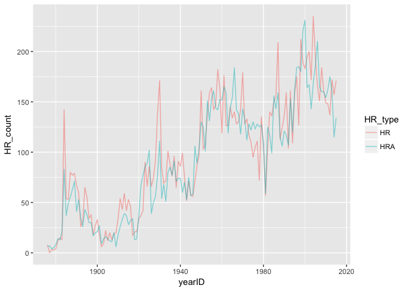

hw\_3\_tidy
================
Kammy Chiu
February 28, 2017

Part 1
------

### 5.1

Reshape the Teams data into long format for the following plot:

``` r
tidy_teams <- Teams %>%
  gather(HR, HRA, key = "HR_type", value = "HR_count")
```

Plot a time series conditioned on whether the HRs that involved the Cubs were hit by them or allowed by them. Note: HR = Homeruns by batters HRA = Homeruns allowed.

``` r
time_series <- tidy_teams %>%
  filter(teamID == "CHN") %>%
  ggplot(aes(x = yearID, y = HR_count)) +
  geom_line(aes(col = HR_type), alpha = .5)
time_series
```



### 5.6

Verify that the following code generates the correct values of -1, 0, -2.

``` r
Treat <- filter(ds1, group=="T")
Control <- filter(ds1, group=="C")
all <- mutate(Treat, diff = Treat$vals - Control$vals)
all
```

    ##   id group vals diff
    ## 1  1     T    4   -1
    ## 2  2     T    6    0
    ## 3  3     T    8   -2

Describe two problems that might arise if the data set is not sorted in a particular order or if one of the observations is missing for one of the subjects.

id is the unique identifier in this data set. If id was not sorted in ascending order to begin with, say 321 for the treatment group and, 231 for the control group, then we would be taking the differences between control groups and treatment groups from different trials. i.e. we would not get the correct differences -1, 0, -2.

If one of the observations is missing for one of the subjects, say the control value for id = 3, then when we take the difference between the treatment and control values, we would be subtracting the control value for id = 1 from the treatment value of id = 3. This is illustrated by the following tables:

``` r
ds2 <- data.frame(id = c(1,2,3,1,2),group = c("T", "T", "T", "C", "C"),
                 vals = c(4.00, 6.00, 8.00, 5.00, 6.00))
Treat2 <- filter(ds2, group=="T")
Control2 <- filter(ds2, group=="C")
all2 <- mutate(Treat2, diff = Treat2$vals - Control2$vals)
all2
```

    ##   id group vals diff
    ## 1  1     T    4   -1
    ## 2  2     T    6    0
    ## 3  3     T    8    3

An alternative approach to generate this variable that is more robust:

``` r
ds1_tidy <- ds1 %>%
  spread(key = group, value = vals) %>%
  mutate(diff = T - C)
ds1_tidy
```

    ##   id  C T diff
    ## 1  1  5 4   -1
    ## 2  2  6 6    0
    ## 3  3 10 8   -2

### 5.7

Convert the following data frame into wide format.

``` r
ds57 <- data.frame(grp = c("A", "A", "B", "B"),
                  sex = c("F", "M", "F", "M"),
                  meanL = c(.22, .47, .33, .55),
                  sdL = c(.11, .33, .11, .31),
                  meanR = c(.34, .57, .40, .65),
                  sdR = c(.08, .33, .07, .27))
ds57
```

    ##   grp sex meanL  sdL meanR  sdR
    ## 1   A   F  0.22 0.11  0.34 0.08
    ## 2   A   M  0.47 0.33  0.57 0.33
    ## 3   B   F  0.33 0.11  0.40 0.07
    ## 4   B   M  0.55 0.31  0.65 0.27

``` r
ds57_wide <- ds57 %>%
  gather(meanL, sdL, meanR, sdR, key = "stat", value = "estimate") %>%
  unite(label, sex, stat, sep = ".") %>%
  spread(key = label, value = estimate)
ds57_wide
```

    ##   grp F.meanL F.meanR F.sdL F.sdR M.meanL M.meanR M.sdL M.sdR
    ## 1   A    0.22    0.34  0.11  0.08    0.47    0.57  0.33  0.33
    ## 2   B    0.33    0.40  0.11  0.07    0.55    0.65  0.31  0.27

Part 2
------

After binding the five Oregon voter history data sets, I randomly selected a subset of the data set and called it "voter\_sample." voter\_sample was quite messy, so I first selected the key columns of interest, then gathered the election dates and their respective values (each voter's participation in each election) into columns. VOTER\_ID and ELECTION together constitute the unique identifier for each observation.

``` r
#load data sets
CD1 <- read_tsv("data/CD1_VoterHistory_Jan2017.txt")
CD2 <- read_tsv("data/CD2_VoterHistory_Jan2017.txt")
CD3 <- read_tsv("data/CD3_VoterHistory_Jan2017.txt")
CD4 <- read_tsv("data/CD4_VoterHistory_Jan2017.txt")
CD5 <- read_tsv("data/CD5_VoterHistory_Jan2017.txt")

#bind data sets
or_vote <- rbind(CD1, CD2, CD3, CD4, CD5)

#create random sample
set.seed(47)
voter_sample <- or_vote %>%
  sample_n(100000)

#tidy voter_sample
voter_tidy <- voter_sample %>%
  select(VOTER_ID, BIRTH_DATE, EFF_REGN_DATE,
         CONFIDENTIAL, STATUS, PARTY_CODE,
         COUNTY, `11/08/2016`:`05/16/2006`) %>%
  gather(`11/08/2016`:`05/16/2006`, key = ELECTION, value = PARTICIPATION)
```
