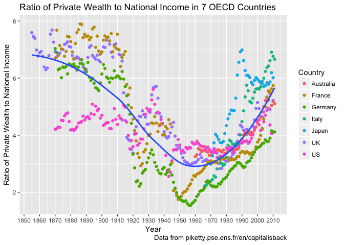
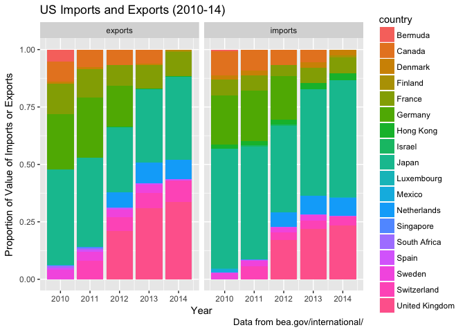

hw\_4\_import
================
Kammy Chiu
March 13, 2017

Introduction
------------

The objective of this excercise is to gain experience with bringing different file types into R. First, I work with .csv files from the Federal Election Commission's (FEC) website on disbursements from Political Action Committees. Then, I move on to work with visualizing Piketty and Zucman's Wealth to Income Ratio Data. Finally, I pulled US imports and exports data from the Bureau of Economic Analysis's (BEA) website.

Campaign Finance
----------------

For this section, I'm interested in visualizing and ranking the top Political Action Committees (PACs) that disbursed over $1 million to political campaigns in 2015-16. First, I import and tidy the datasets for leadership PACs and non-leadership PACS from the Federal Election Commission's (FEC) website.

``` r
#load FEC data sets
leadPACs <- read_csv("data/LeadershipAction.csv")
PACs <- read_csv("data/CommitteeSummaryAction.csv")

#tidy non-leadership PACs
tidy_PACs <- PACs %>%
  mutate(tot_dis = str_replace_all(tot_dis, "\\$", "")) %>%
  mutate(tot_dis = str_replace_all(tot_dis, ",", "")) %>%
  mutate(tot_dis = as.numeric(tot_dis)) %>%
  select(com_id, com_nam, tot_dis) %>%
  filter(tot_dis >= 1000000) %>%
  arrange(desc(tot_dis))

#tidy leadership PACs
tidy_leadPACs <- leadPACs %>%
  mutate(tot_dis = str_replace_all(tot_dis, "\\$", "")) %>%
  mutate(tot_dis = str_replace_all(tot_dis, ",", "")) %>%
  mutate(tot_dis = as.numeric(tot_dis)) %>%
  select(com_id, com_nam, tot_dis) %>%
  filter(tot_dis >= 1000000)
```

Besides ranking the PACs in terms of disbursements, I also wanted to visualize each PAC's party affiliation. Since party affiliation was not recorded in the spreadsheets, I did a quick Google search for the 29 PACs that disbursed over $1 million. I code this information with 1 = Democratic, 0 = Republican in a 2-column data frame. I then proceed to bind and join the 3 data sets. Although the process of creating a dataframe for party affiliation is not entirely reproducible, I think this information makes for a much more interesting graphic.

``` r
#Create dataframe for party affiliation
party <- data.frame(com_id = c("C00428052","C00416131","C00271338","C00425470","C00331694","C00327395","C00348607","C00399196","C00347195","C00344234","C00412791","C00362384", "C00377689","C00570226","C00387464","C00235655","C00305805","C00235572","C00566851","C00409003","C00467431","C00500025","C00493924","C00552851","C00440032","C00325357","C00459123","C00540187","C00491654","C00010603","C00401224","C00000935","C00042366","C00193433","C00003418","C00075820","C00027466","C00289983"), party = c(1,1,1,1,1,1,1,1,1,1,1,1,0,0,0,0,0,0,0,0,0,0,0,0,0,0,0,0,0,1,1,1,1,1,0,0,0,0))

#bind data sets
full_PACs <- rbind(tidy_leadPACs,tidy_PACs) %>%
  full_join(party, by = "com_id") %>%
  mutate(dis_mil = tot_dis/1000000)
```

I go on to create a bar plot that visualizes disbursements by PACs. I map affiliated party onto fill (color), where red conveniently represents Republican affiliated PACs, and blue represents Democratic affiliated PACs. I order the bars by disbursements such that the top contributors would be at the top of the chart for easy viewing.

``` r
#ordered plot
full_PACs %>%
  ggplot() +
  geom_col(aes(x=fct_reorder(com_nam,dis_mil), y=dis_mil, fill=factor(party))) +
  coord_flip() +
  ggtitle("PACs Disbursements 2015-16 (greater than $1mil)") +
  labs(
    x="PAC Name",
    y="Disbursements (millions of $)",
    fill="Affiliated Party",
    caption="Data from fec.gov"
  )
```


Piketty and Zucman's Wealth to Income Ratio Data
------------------------------------------------

I obtained my first data set from Thomas Piketty's website. Piketty is the author of "Capital in the Twenty-First Century", a national best-seller that discusses income inequality in rich countries. This data set was extracted from spreadsheets containing data for Piketty and Zucman's "Capital is Back: Wealth-Income Ratios in Rich Countries 1700-2010". Data for different countries were assembled in different spreadsheets, and each spreadsheet contained figures for the composition of national income and private wealth. I begin my tidying process by selecting columns of interest and binding data frames together:

``` r
data_list <- list(UK, Australia, USA, France, Italy, Germany, Japan)

clean_df <- function(data, country_name){
  names(data) <- make.unique(names(data))
  colnames(data)[1] <- "year"
  colnames(data)[2] <- "NI"
  colnames(data)[3] <- "PW"

data %>%
  filter(!is.na(year)) %>%
  filter(!is.na(NI)) %>%
  select(1:3) %>%
  mutate(year = substr(year, 1, 4)) %>%
  mutate(PW = as.numeric(PW)) %>%
  mutate(NI = as.numeric(NI)) %>%
  mutate(ratio = PW/NI) %>%
  mutate(country = country_name)
}

UK_df <- clean_df(UK, "UK")
Aus_df <- clean_df(Australia, "Australia")
USA_df <- clean_df(USA, "US")
FR_df <- clean_df(France, "France")
IT_df <- clean_df(Italy, "Italy")
DE_df <- clean_df(Germany, "Germany")
JP_df <- clean_df(Japan, "Japan")
```

``` r
#bind data sets
PW_NI <- rbind(UK_df, Aus_df, USA_df, FR_df, IT_df, DE_df, JP_df)
```

I pulled two aggregate figures that informed Piketty and Zucman's key finding in their paper - national income and private wealth figures for 7 OECD countries. After tidying and binding the data sets, I created a new column for the wealth-income ratio in each country and plotted the ratios against time. I used `geom_smooth` to allow for a visual confirmation of Piketty and Zucman's claim that "today's ratios appear to be returning to the high values observed in Europe in the eighteenth and nineteenth centuries" (Piketty and Zucman, 2014).

``` r
#make plot
PW_NI %>%
  filter(!is.na(ratio)) %>%
  ggplot(aes(x=as.numeric(year), y=ratio)) +
  geom_point(aes(col=country)) +
  geom_smooth(se = F) +
  labs(
    title = paste("Ratio of Private Wealth to National Income in 7 OECD Countries"),
    x = "Year",
    y = "Ratio of Private Wealth to National Income",
    col="Country",
    caption="Data from piketty.pse.ens.fr/en/capitalisback"
  ) +
  scale_x_continuous(breaks = seq(1850, 2015, by = 10))
```



US Imports and Exports Data
---------------------------

My last data set comes from the international trade page on the Bureau of Economic Analysis's (BEA) website. Here I'm interested in looking at the US's trade relations with other countries in terms of exports and imports in 2010-2014. I begin the tidying process by selecting columns of interest, filtering out missing values and non-countries, e.g. the EU, and finally binding the data sets across different years:

``` r
years <- 2010:2014
paste0("data/", years[1], ".xls")
```

    ## [1] "data/2010.xls"

``` r
data_files_vec <- vector(length = 0)
for(i in seq_along(years))
  data_files_vec <- c(data_files_vec, paste0("data/", years[i], ".xls"))

year_10_14_list <- map(data_files_vec, read_excel, sheet = "I.A3", col_names = TRUE, col_types = NULL, 
                      na = "",  skip = 7)
```

    ## DEFINEDNAME: 20 00 00 01 0b 00 00 00 01 00 00 00 00 00 00 06 3b 00 00 00 00 12 00 00 00 09 00 
    ## DEFINEDNAME: 20 00 00 01 0b 00 00 00 01 00 00 00 00 00 00 06 3b 00 00 00 00 12 00 00 00 09 00 
    ## DEFINEDNAME: 20 00 00 01 0b 00 00 00 01 00 00 00 00 00 00 06 3b 00 00 00 00 12 00 00 00 09 00 
    ## DEFINEDNAME: 20 00 00 01 0b 00 00 00 01 00 00 00 00 00 00 06 3b 00 00 00 00 12 00 00 00 09 00 
    ## DEFINEDNAME: 20 00 00 01 0b 00 00 00 01 00 00 00 00 00 00 06 3b 00 00 00 00 12 00 00 00 09 00 
    ## DEFINEDNAME: 20 00 00 01 0b 00 00 00 01 00 00 00 00 00 00 06 3b 00 00 00 00 12 00 00 00 00 00 
    ## DEFINEDNAME: 20 00 00 01 0b 00 00 00 01 00 00 00 00 00 00 06 3b 00 00 00 00 12 00 00 00 00 00 
    ## DEFINEDNAME: 20 00 00 01 0b 00 00 00 01 00 00 00 00 00 00 06 3b 00 00 00 00 12 00 00 00 00 00 
    ## DEFINEDNAME: 20 00 00 01 0b 00 00 00 01 00 00 00 00 00 00 06 3b 00 00 00 00 12 00 00 00 00 00 
    ## DEFINEDNAME: 20 00 00 01 0b 00 00 00 01 00 00 00 00 00 00 06 3b 00 00 00 00 12 00 00 00 00 00 
    ## DEFINEDNAME: 20 00 00 01 0b 00 00 00 01 00 00 00 00 00 00 06 3b 00 00 00 00 12 00 00 00 00 00 
    ## DEFINEDNAME: 20 00 00 01 0b 00 00 00 01 00 00 00 00 00 00 06 3b 00 00 00 00 12 00 00 00 00 00 
    ## DEFINEDNAME: 20 00 00 01 0b 00 00 00 01 00 00 00 00 00 00 06 3b 00 00 00 00 12 00 00 00 00 00 
    ## DEFINEDNAME: 20 00 00 01 0b 00 00 00 01 00 00 00 00 00 00 06 3b 00 00 00 00 12 00 00 00 00 00 
    ## DEFINEDNAME: 20 00 00 01 0b 00 00 00 01 00 00 00 00 00 00 06 3b 00 00 00 00 12 00 00 00 00 00 
    ## DEFINEDNAME: 20 00 00 01 0b 00 00 00 01 00 00 00 00 00 00 06 3b 00 00 00 00 12 00 00 00 00 00 
    ## DEFINEDNAME: 20 00 00 01 0b 00 00 00 01 00 00 00 00 00 00 06 3b 00 00 00 00 12 00 00 00 00 00 
    ## DEFINEDNAME: 20 00 00 01 0b 00 00 00 01 00 00 00 00 00 00 06 3b 00 00 00 00 12 00 00 00 00 00 
    ## DEFINEDNAME: 20 00 00 01 0b 00 00 00 01 00 00 00 00 00 00 06 3b 00 00 00 00 12 00 00 00 00 00 
    ## DEFINEDNAME: 20 00 00 01 0b 00 00 00 01 00 00 00 00 00 00 06 3b 00 00 00 00 12 00 00 00 00 00 
    ## DEFINEDNAME: 20 00 00 01 0b 00 00 00 01 00 00 00 00 00 00 06 3b 00 00 00 00 12 00 00 00 00 00 
    ## DEFINEDNAME: 20 00 00 01 0b 00 00 00 01 00 00 00 00 00 00 06 3b 00 00 00 00 12 00 00 00 00 00 
    ## DEFINEDNAME: 20 00 00 01 0b 00 00 00 01 00 00 00 00 00 00 06 3b 00 00 00 00 12 00 00 00 00 00 
    ## DEFINEDNAME: 20 00 00 01 0b 00 00 00 01 00 00 00 00 00 00 06 3b 00 00 00 00 12 00 00 00 00 00 
    ## DEFINEDNAME: 20 00 00 01 0b 00 00 00 01 00 00 00 00 00 00 06 3b 00 00 00 00 12 00 00 00 00 00

``` r
clean_year_data <- function(data, year1){
  names(data) <- make.unique(names(data))
  colnames(data)[1] <- "country"
  colnames(data)[9] <- "exports"
  colnames(data)[10] <- "imports"
  
  data %>%
    select(country, exports, imports) %>%
    filter(exports != "(D)", exports != "(*)", imports != "(*)",
           imports != "(D)", country != "Europe",
           country != "Latin America and Other Western Hemisphere",
           country != "South and Central America",
           country != "Other",
           country != "Other Western Hemisphere",
           country != "Asia and Pacific",
           !stringr::str_detect(country, "European Union")) %>% 
    mutate(year = year1)
}

`2010_df` <- clean_year_data(year_10_14_list[[1]], 2010)
`2011_df` <- clean_year_data(year_10_14_list[[2]], 2011)
`2012_df` <- clean_year_data(year_10_14_list[[3]], 2012)
`2013_df` <- clean_year_data(year_10_14_list[[4]], 2013)
`2014_df` <- clean_year_data(year_10_14_list[[5]], 2014)

#for loop for more years (for future use)
#list_of_year_dfs <- list()
#for(i in seq_along(years))
#  list_of_year_dfs[[i]] <- clean_year_data(year_10_14_list[[i]], years[i])

fdi_US <- rbind(`2010_df`,`2011_df`,`2012_df`,`2013_df`,`2014_df`)

fdi_US <- fdi_US %>%
  mutate(exports = as.numeric(str_replace_all(exports, ",", ""))) %>%
  mutate(imports = as.numeric(str_replace_all(imports, ",", ""))) %>%
  gather(exports, imports, key = "x_or_m", value = "value") %>%
  filter(value >= 100)
```

After tidying and binding my data sets, I made a simple stacked bar plot that displayed the relative proportion of imports and exports from each trading partner across years 2010-14. In constructing my bar plot, I used `position_fill` to standardize each stack to have unit height for easy comparison of trade proportions across years. This bar plot reveals that Japan is one of the US's biggest importers, and is also one of the biggest exporters to the US.

A note on missing data: Some values were suppressed to avoid the disclosure of information on an individual company. Nonzero values between -$500,000 and $500,000 were also suppressed. Observations containing these values were removed from the data set during the tidying process, thus the visualization may not contain full information on the US's imports and exports.

``` r
fdi_US %>%
  filter(value > 500) %>%
  ggplot(aes(x=year, y=value)) +
  geom_col(position = "fill", aes(fill = country)) +
  facet_wrap(~ x_or_m) +
  labs(
    title = paste("US Imports and Exports (2010-14)"),
    x = "Year",
    y = "Proportion of Value of Imports or Exports",
    col="Country",
    caption="Data from bea.gov/international/"
  )
```


